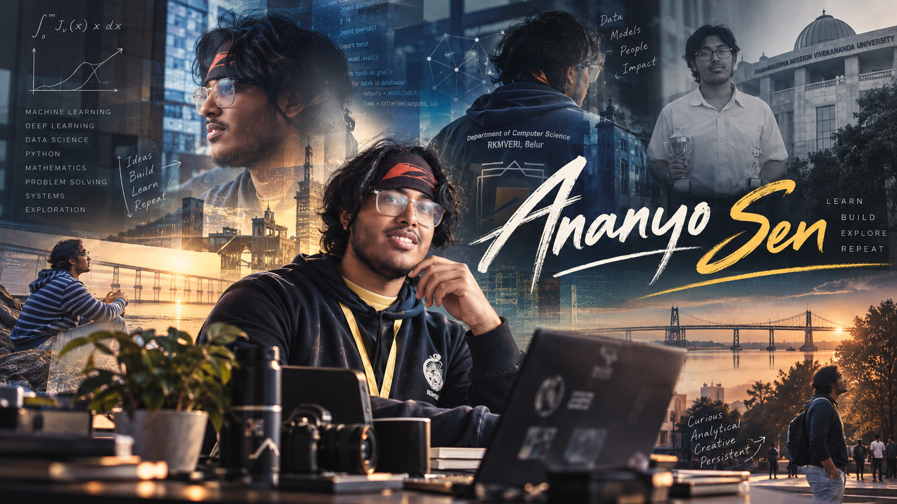

<div align="center">



# Hi, I'm Ananyo Sen 👋

### MSc in Data Science & Artificial Intelligence

**Data Science • Machine Learning • Artificial Intelligence**

</div>

---

## 👨‍💻 About Me

I am an **MSc student in Data Science and Artificial Intelligence at RKMVERI, Belur**, with a background in **Mathematics**.

My experience combines a strong foundation in **machine learning and deep learning** with hands-on work in building **AI and data-driven systems**. My mathematical background also allows me to explore problems from their underlying theoretical foundations and understand the processes behind them.

I am particularly interested in developing practical solutions involving **data analysis, machine learning, deep learning, artificial intelligence, and intelligent systems**.

---

## 🎓 Education

**Ramakrishna Mission Vivekananda Educational and Research Institute (RKMVERI)**
*MSc in Data Science and Artificial Intelligence* · 2025–2027

**Ramakrishna Mission Vidyamandira, Belur**
*BSc (Honours) in Mathematics* · 2022–2025

---

## 🧠 Areas of Interest

* Machine Learning
* Deep Learning
* Artificial Intelligence
* Data Science
* Statistical Analysis
* Time Series Analysis
* Natural Language Processing
* Computer Vision
* Distributed Computing
* Graph Theory
* Multimodal AI

---

## 🛠️ Technical Skills

### Languages

`Python` · `JavaScript` · `R` · `C++` · `LaTeX`

### Frameworks & Libraries

`Scikit-Learn` · `NumPy` · `Pandas` · `PyTorch` · `Matplotlib` · `Streamlit`

### Tools & Platforms

`Git` · `GitHub` · `Flask` · `MS Office`

### Operating Systems

`Windows` · `Ubuntu Linux`

---

## 🚀 Projects

### Distributed Gaming Analytics System Using Ray

A scalable gaming analytics platform using **Ray** for distributed and parallel player analysis and prediction, with statistical analysis and a **Flask-based web interface**.

**Technologies:** `Python` · `Ray` · `Machine Learning` · `Statistical Analysis` · `Flask`

---

### Event-Driven Multi-Modal Sports Video Understanding

A deep learning framework for understanding sports videos through **event detection, tactical interaction modeling, and match-intensity estimation**, with the broader objective of supporting automated sports analysis and future commentary generation.

**Focus:** `Deep Learning` · `Video Understanding` · `Multimodal AI` · `Event Detection`

---

### Deep Q-Networks for Partially Observable Treasure Hunt

A **Deep Reinforcement Learning** project involving an intelligent agent navigating a partially observable environment with limited visibility, dynamic obstacles, sparse rewards, and multiple difficulty levels.

**Focus:** `Deep Reinforcement Learning` · `DQN` · `Decision Making` · `Navigation`

---

### Prediction of Video Game Sales

A machine learning project focused on predicting global video-game sales through **exploratory data analysis, feature engineering, regression modeling, evaluation, and visualization**.

**Focus:** `Data Science` · `Machine Learning` · `Regression` · `Data Visualization`

---

## 🔬 Research Experience

### Statistical Methods and Literature Review for Machine Learning in Mental Health

Conducted a structured study of **statistical hypothesis testing, ANOVA, power analysis, sample-size estimation, and non-parametric methods**, alongside a literature review of machine learning applications in mental health.

Also studied psychometric validation research involving **SERATS, SERAPTS, and FERATS**, and presented technical findings through academic seminars.

---

### Computational Analysis of Comic Narrative Flow

Conducting a literature review on **computational comic understanding**, studying machine learning approaches for modeling narrative flow.

The work explores **emotion recognition, panel transition understanding, multimodal reasoning, and context inference** to investigate how AI can interpret comic sequences and identify potential research directions.

---

## 📚 Relevant Coursework

* Machine Learning
* Artificial Intelligence
* Deep Learning
* Probability and Statistics
* Linear Algebra
* Time Series Analysis
* Graph Theory
* Distributed Computing
* Data Structures and Algorithms

---

## 🏆 Achievements

* **CUET-PG 2025 (Mathematics)** — Qualified
* **JBNSTS Junior Scholarship** — 2020
* **1st Place** — Enigma Quest, Puzzle Solving, Perceptron'25, RKMVERI
* **2nd Place** — Poster Presentation on *Real Analysis and Its Applications*, RKM Vidyamandira

---

## 📜 Certification

**NPTEL — Programming in Modern C++** · 2025

---

## 📊 What I'm Exploring

```text
Mathematics
     │
     ▼
   Data
     │
     ▼
Machine Learning
     │
     ▼
Deep Learning & AI
     │
     ▼
Intelligent Systems
```

---

## 🌐 Connect With Me

<div align="center">

<a href="https://github.com/Ananyo-Sen-B2530066">

</a>

<a href="https://www.linkedin.com/in/ananyo-sen-7884b1362">

</a>

<a href="https://ananyosenportfolio.netlify.app/">

</a>

</div>

---

<div align="center">

### *Exploring data. Understanding models. Building intelligent systems.*

</div>

